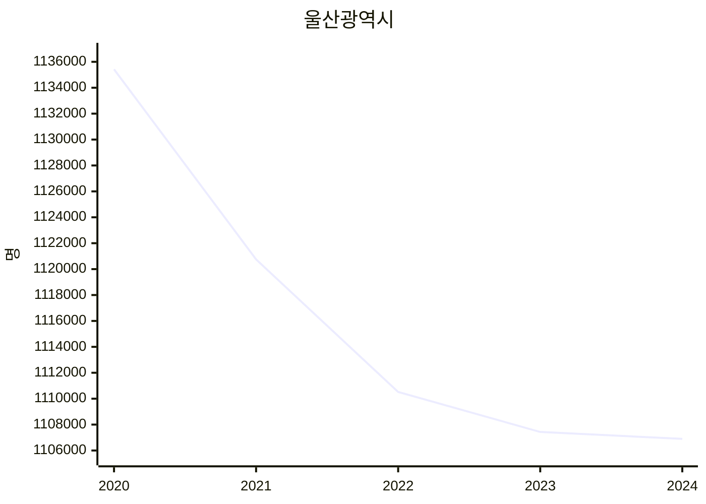
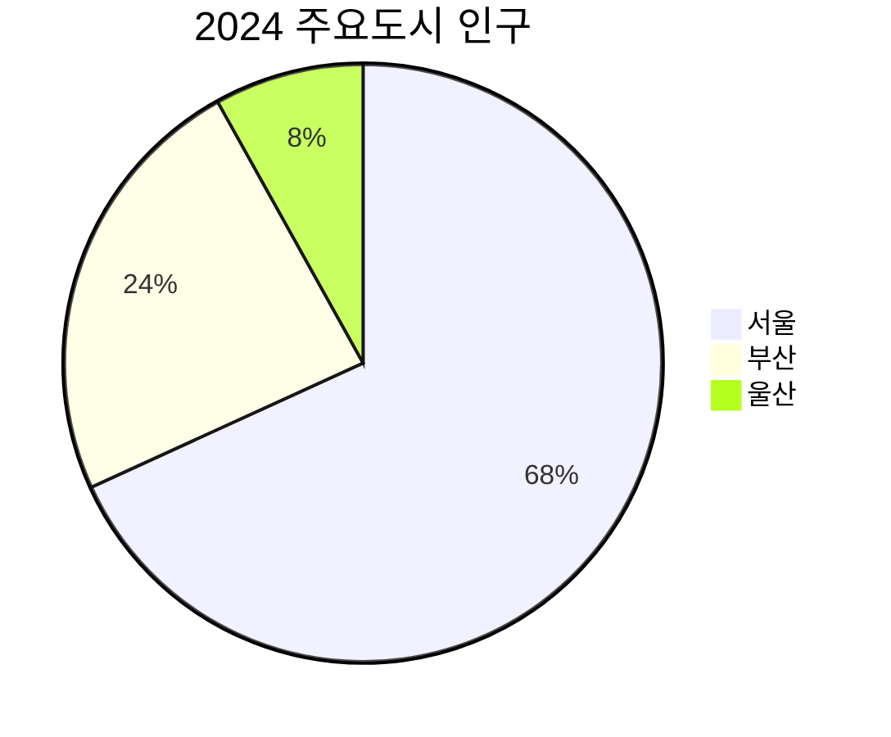

# 14. 차트 시각화

## 14.1 개요

`kosis chart` 명령으로 통계 데이터를 시각화합니다. 별도의 코드 작성 없이 CLI에서 바로 차트를 생성할 수 있습니다.

## 14.2 출력 포맷

| 포맷 | 플래그 | 라이브러리 | 용도 | Windows 호환 |
|------|--------|-----------|------|:---:|
| 터미널 | `--format terminal` (기본) | asciigraph | 터미널에서 바로 확인 | O |
| PNG | `--format png` | gonum/plot | 이미지 저장, 보고서 | O |
| SVG | `--format svg` | gonum/plot | 벡터 이미지, 웹 삽입 | O |
| PDF | `--format pdf` | gonum/plot | 인쇄, 보고서 | O |
| HTML | `--format html` | go-echarts | 인터랙티브 차트 (확대/축소/툴팁) | O |
| Excel | `--format excel` | excelize | 데이터+차트 함께 내보내기 | O |
| Mermaid | `--format mermaid` | 내장 | Markdown 문서 삽입 (GitHub/Notion 렌더링) | O |

> 모든 포맷이 순수 Go 라이브러리 기반이므로 Windows/macOS/Linux 크로스 플랫폼 완벽 호환

## 14.3 차트 타입

| 타입 | 플래그 | 용도 |
|------|--------|------|
| 라인 | `--type line` (기본) | 시계열 추이 (인구, GDP, 물가 등) |
| 바 | `--type bar` | 항목 간 비교 (지역별, 연도별) |
| 파이 | `--type pie` | 구성비 (비율, 점유율) |

## 14.4 사용법

### 기본 문법

```bash
kosis chart [플래그]
```

| 플래그 | 설명 | 기본값 |
|--------|------|--------|
| `--input, -i` | 입력 파일 (JSON/CSV) | stdin (파이프) |
| `--type, -t` | 차트 타입 (line/bar/pie) | `line` |
| `--format` | 출력 포맷 | `terminal` |
| `--output, -o` | 출력 파일 경로 | stdout (터미널) |
| `--title` | 차트 제목 | 자동 생성 |
| `--width` | 차트 너비 | 포맷별 기본값 |
| `--height` | 차트 높이 | 포맷별 기본값 |
| `--open` | 생성 후 브라우저/뷰어로 열기 | `false` |

### `data` 명령에 내장된 `--chart` 플래그

데이터 조회와 차트 생성을 한 번에 실행할 수 있습니다.

```bash
kosis data <ORG_ID> <TBL_ID> [data 플래그] --chart <타입> [--chart-format <포맷>] [--title <제목>] [-o <파일>] [--open]
```

| 플래그 | 설명 | 기본값 |
|--------|------|--------|
| `--chart` | 차트 타입 (line/bar/pie) | - (차트 미생성) |
| `--chart-format` | 차트 출력 포맷 (terminal/png/svg/pdf/html/excel/mermaid) | `terminal` |
| `--title` | 차트 제목 (상단 중앙 표시) | 자동 생성 |

**모든 차트 포맷에서 제목과 범례가 표시됩니다:**

| 포맷 | 제목 위치 | 범례 위치 |
|------|----------|----------|
| terminal | 상단 중앙 | 하단 (색상 ■ 표시) |
| html | 상단 중앙 | 우측 상단 |
| png/svg/pdf | 상단 중앙 | 좌측 상단 |
| mermaid | 상단 중앙 | `> 범례:` 주석 |
| excel | 상단 중앙 | 상단 |

**다중 시리즈**: 분류값이 여러 개이면 자동으로 시리즈를 분리하여 하나의 차트에 오버레이합니다.

## 14.5 사용 예시

### 방법 1: `data --chart` (한 줄로 조회+차트)

```bash
# 터미널 차트 (기본)
kosis d 101 DT_1IN1502 -c1 26 -i T100 -p Y -l 10 --chart line

# PNG 이미지로 저장
kosis d 101 DT_1IN1502 -c1 26 -i T100 -p Y -l 10 --chart line --chart-format png -o 울산인구.png

# HTML 인터랙티브 차트 + 브라우저 자동 열기
kosis d 101 DT_1IN1502 -c1 26 -i T100 -p Y -l 10 --chart line --chart-format html -o 울산인구.html --open

# PDF 보고서용
kosis d 301 DT_200Y101 -c1 ALL -i ALL -p Y -l 10 --chart bar --chart-format pdf -o GDP.pdf

# Excel에 데이터+차트 함께
kosis d 101 DT_1DA7002S -c1 00 -i ALL -p M -l 12 --chart line --chart-format excel -o 경활.xlsx
```

### 방법 2: 파이프 (`data` → `chart`)

```bash
# 데이터를 JSON으로 출력 후 차트로 전달
kosis d 101 DT_1IN1502 -c1 26 -i T100 -p Y -l 10 -f json | kosis chart --type line

# HTML로 저장
kosis d 101 DT_1IN1502 -c1 26 -i T100 -p Y -l 10 -f json | kosis chart --type bar --format html -o chart.html --open
```

### 방법 3: 파일 입력

```bash
# 이전에 저장한 JSON 파일로 차트 생성
kosis chart --input ulsan_pop.json --type line --format png -o ulsan.png

# CSV 파일로 차트 생성
kosis chart --input data.csv --type bar --title "지역별 인구 비교" --format html -o compare.html --open
```

## 14.6 터미널 차트 출력 예시

```
 울산광역시 총인구 추이 (명)
 1,180,000 ┤╮
 1,170,000 ┤ ╰╮
 1,160,000 ┤   ╰──╮
 1,150,000 ┤      ╰╮
 1,140,000 ┤       ╰──╮
 1,130,000 ┤          ╰╮
 1,120,000 ┤           ╰──
            2018 2019 2020 2021 2022 2023
```

## 14.7 `--open` 동작

파일 포맷(html/png/svg/pdf/excel) 사용 시 `--open` 플래그로 생성 후 자동 열기:

| OS | 실행 명령 |
|---|---|
| macOS | `open <파일>` |
| Windows | `start <파일>` |
| Linux | `xdg-open <파일>` |

## 14.8 AI 활용 시나리오

사용자가 AI에게 통계 데이터를 요청하고 차트를 원할 때, AI가 코드를 생성하지 않고 `kosis` 명령만으로 처리합니다.

```
사용자: 울산광역시 인구추이 보여줘
AI 실행: kosis d 101 DT_1IN1502 -c1 26 -i T100 -p Y -l 10

사용자: 그래프로 만들어줘
AI 실행: kosis d 101 DT_1IN1502 -c1 26 -i T100 -p Y -l 10 --chart line

사용자: 이미지로 저장해줘
AI 실행: kosis d 101 DT_1IN1502 -c1 26 -i T100 -p Y -l 10 --chart line --chart-format png -o 울산인구.png

사용자: HTML로 보여줘
AI 실행: kosis d 101 DT_1IN1502 -c1 26 -i T100 -p Y -l 10 --chart line --chart-format html -o 울산인구.html --open

사용자: Markdown에 넣을 수 있게 해줘
AI 실행: kosis d 101 DT_1IN1502 -c1 26 -i T100 -p Y -l 10 --chart line --chart-format mermaid
```

## 14.9 Mermaid 차트

Markdown 문서에 삽입 가능한 Mermaid 다이어그램을 생성합니다. GitHub, GitLab, Notion 등에서 렌더링됩니다.

```bash
# 라인 차트
kosis d 101 DT_1IN1502 -c1 26 -i T100 -p Y -l 5 --chart line --chart-format mermaid

# 다중 시리즈 비교
kosis d 101 DT_1IN1502 -c1 "00+11+26" -i T100 -p Y -l 3 --chart line --chart-format mermaid

# 바 차트
kosis d 101 DT_1IN1502 -c1 "00+11+26" -i T100 -p Y -l 1 --chart bar --chart-format mermaid

# 파이 차트
kosis d ... -f json | kosis chart --type pie --format mermaid --title "제목"

# 파일로 저장
kosis d 101 DT_1IN1502 -c1 26 -i T100 -p Y -l 5 --chart line --chart-format mermaid -o chart.md
```

출력 예시 (라인):
````

````

출력 예시 (파이):
````

````

> **참고**: Mermaid xychart-beta는 다중 시리즈를 지원하지만 범례 표시가 제한적입니다. 다중 시리즈 차트에는 자동으로 `> 범례:` 주석이 추가됩니다.
